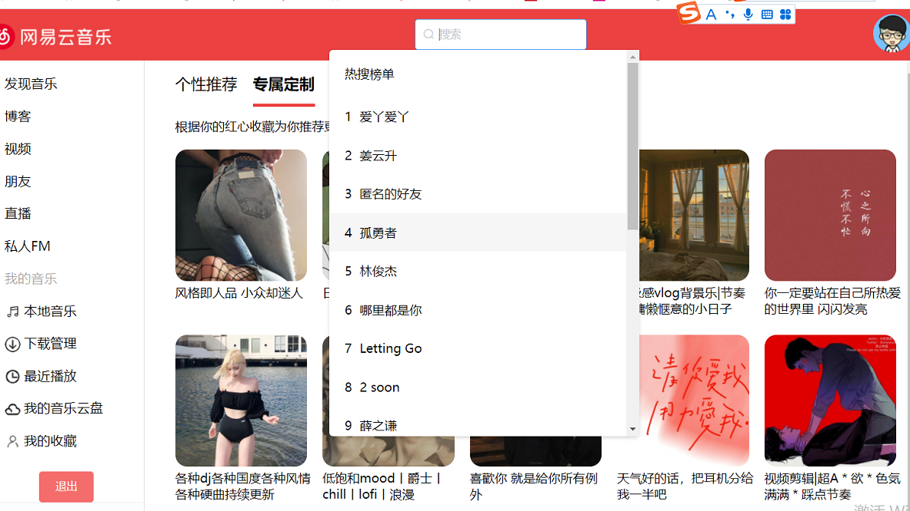

# 前言

肝代码不易，请路过的朋友们随手点个Star。本项目仅用于学习。 

## 高仿pc端网易云音乐Vue前端项目

### 技术栈

Vue+Vue-Router+Vuex+Axios+element-ui

### 项目地址
Github地址： https://github.com/mingzhangli/vuemusicProject.git"

#### 项目安装和使用

1.安装依赖  

<table><tr><td bgcolor=#7FFFD4>yarn install</td></tr></table>

2.运行项目  

<table><tr><td bgcolor=#7FFFD4>yarn serve</td></tr></table>  

3.效果展示

## 功能特性

1. 登录
2. 刷新登录
3. 发送验证码
4. 校验验证码
5. 注册(修改密码)
6. 获取用户信息 , 歌单，收藏，mv, dj 数量
7. 获取用户歌单
8. 获取用户电台
9. 获取用户关注列表
10. 获取用户粉丝列表
11. 获取用户动态
12. 获取用户播放记录
13. 获取精品歌单
14. 获取歌单详情
15. 搜索
16. 搜索建议
17. 获取歌词
18. 歌曲评论
19. 收藏单曲到歌单
20. 专辑评论
21. 歌单评论
22. mv 评论
23. 电台节目评论
24. banner
25. 获取歌曲详情
26. 获取专辑内容
27. 获取歌手单曲
28. 获取歌手 mv
29. 获取歌手专辑
30. 获取歌手描述
31. 获取相似歌手
32. 获取相似歌单
33. 相似 mv
34. 获取相似音乐
35. 获取每日推荐歌单
36. 获取每日推荐歌曲
37. 最新 mv
38. 推荐 mv
39. 推荐歌单
40. 推荐新音乐
41. 推荐电台
42. 推荐节目
43. 独家放送
44. mv 排行
45. 播放 mv/视频

